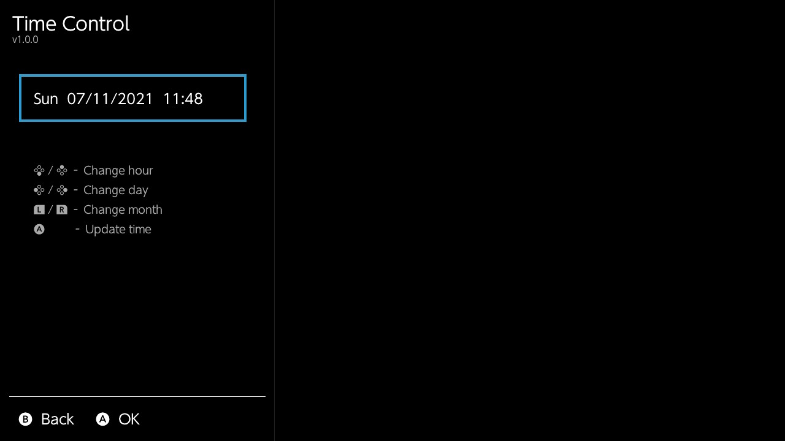

# Time Control
A simple Tesla overlay to control system time

## Installation
* Setup the [tesla menu](https://github.com/WerWolv/Tesla-Menu) and [nx-ovlloader](https://github.com/WerWolv/ovl-sysmodules)
* Extract the [latest release](https://github.com/Manlibear/TimeControlOVL/releases/latest) to the SD card

## Usage
Button          | Action
----------------|-------------------
Up / Down       | Changes the hour
Left / Right    | Changes the day
L / R           | Changes the month
A               | Update the time

## Screenshot

## Game Specific Features

Game    | Feature
--------|--------
Animal Crossing | Automatically updates time in game 

## Credits
* [libtestla](https://github.com/WerWolv/libtesla) by [WerWolv](https://github.com/WerWolv) as base for this overlay (and being super helpful on Discord)
* [switch-time](https://github.com/3096/switch-time) by [3096]( https://github.com/3096) for inspiration
* [ACNHMobileSpawner](https://github.com/berichan/ACNHMobileSpawner) by [berichan](https://github.com/berichan/) for offsets for ACNH time info
* [sys-botbase](https://github.com/olliz0r/sys-botbase) by [olliz0r](https://github.com/olliz0r) for a basis for memory shenanigans
* [libnx](https://github.com/switchbrew/libnx) as base of almost all switch homebrew